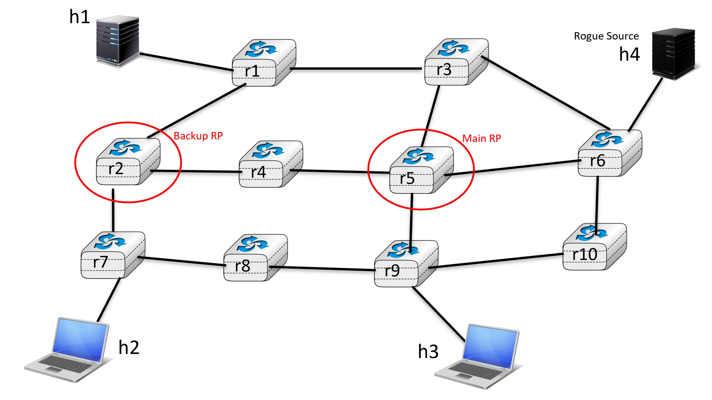

# Multicast using PIM-Sarse-Mode

Note : it is recommended to view this project in VsCode using Remote Explorer extension if you are connecting via SSH, it makes it easier to download the video output and navigate config files


## Project objectives
The objective of this project was to create a lab environment using FRRouting that supports PIM-Sparse-Mode and consisting of at least one sender/server streaming a video and several receivers/clients displaying it using `ffmpeg` to send a video stream via multicast and allowing multiple devices to access the same content without overloading the network.

We also had to choose a central location for the network Rendezvous Point (RP) and deploy security measures to avoid Rogue Servers and RP to attack the network/disrupt it.

<!-- TODO: chosen group prefix -->


## Network topology


<!-- 
Schematic of the network if you are reading this in a terminal :
> r5 is RP
> r2 is backup RP
> h1 is server
> h2 & h3 are clients
> h4 is Rogue server
```
                          ┌─────┐
                          │ h1  │ => fc00:2142:1::
                          └──┬──┘
                             |
                          ┌──┴─┐   ┌────┐
                     ┌────┼ r1 ┼───┤ r3 ┼─────┐
                     |    └────┘   └──┬─┘     |
                  ┌──┴─┐  ┌────┐   ┌──┴─┐  ┌──┴─┐    ┌─────┐
                  |<r2>┼──┤ r4 ┼───┼<r5>┼──┤ r6 ┼────┤(h4) │ => fc00:2142:6::
                  └──┬─┘  └────┘   └──┬─┘  └──┬─┘    └─────┘
                  ┌──┴─┐  ┌────┐   ┌──┴─┐  ┌──┴─┐
                  | r7 ┼──┤ r8 ┼───┼ r9 ┼──┤r10 |
                  └──┬─┘  └────┘   └──┬─┘  └────┘
                     |                |
                  ┌──┴──┐          ┌──┴──┐
 fc00:2142:7:: => │ h2  │          │ h3  │ => fc00:2142:9::
                  └─────┘          └─────┘
```
-->


## Rendezvous Point (RP)
### Rendezvous Point (RP) location choice
We decided the Rendezvous Point should be at the crossroad of as many routers as possible for maximum efficiency in redistributing the multicast packets between the server and the clients and in the case of our current network we found 'r5' to be perfect for this role.

Additionally we added r2 as a backup RP should r5 fail unexpectedly.

### Testing the backup Rendezvous Point
Run the script `./test_RP.sh` to verify that 'r2' does indeed take over 'r5' RP duties in case of failure.
In this test scenario we manually break 'r5' by shutting it down and checking which router is detected as RP by every router in the network.


## Security policies
### Against Rogue RP
Our hosts can't be candidate bsr and can't receive candidate bsr advertisement from routers
<!-- TODO: -->


### Against Rogue Sources
We limited the authorized incoming hosts to the ones already registered in the network (h1) <!-- TODO:+++ -->
<!-- TODO: nft firewall -->

### Testing the protection against Rogue sources
<!-- TODO: try to send stream from h4 to a client => shouldn't work -->


## Sending a video stream via multicast

### 1. Run the automated script for streaming and recording :
```
./stream_and_record.sh [SERVER_NAME] [CLIENT_NAME] [DURATION (optional and > 5)]
```
This will start a stream on the server `SERVER_NAME`, subscribe the client `CLIENT_NAME` to the stream, record the stream into a video during `DURATION` seconds (must be > 5 seconds) or 20 seconds by default and finally save it to the project root.

You can run this command in two different terminals to simulate streaming to both clients.
See example below :

Stream from h1, watch on h2 :
```
./stream_and_record.sh h1 h2
```
Stream from h1, watch on h3 for a longer time :
```
./stream_and_record.sh h1 h3 50
```

### 2. Download the video output from this folder to your physical computer :
- Using VSCode Remote-SSH : right-click the video file and save it
- Using `sftp` (the file will be saved in your user folder) :
```
sftp vm
sftp> <project_folder_name>/output.mp4
```

### 3. Open the video with your favourite video player
Note that you might need to install MMPEG-2 codec in order to read it. If you can't make it work VLC media player is able to read MMPEG-2 type video files.
The forced MMPEG-2 formatting is due to `ffmpeg` way of transmitting video files

### 4. Enjoy the video !


## Navigating the project, reading the firewall rules, debugging commands for unicast and multicast
You can access any container using `./open.sh [CONTAINER] [INTERFACE (optional)]` (for examples use `./help.sh`).

Note : to see multicast events on routers you need to first stream a video first !

### Testing unicast connections with `ping` (or `traceroute`)

From any host/router towards any router X :
```
ping fc00:2142::X
```
From any host/router towards h1 :
```
ping fc00:2142:1::
```
From any host/router towards h2 :
```
ping fc00:2142:7::
```
From any host/router towards h3 :
```
ping fc00:2142:9::
```
From any host/router towards h4 :
```
ping fc00:2142:6::
```


### Checking nft tables rules on a host
```
nft list ruleset
```
Alternatively the entire list of implemented rules can also be seen in `/startup_files/nftables.sh`


### Testing multicast on a router

#### Show how many packets and bytes passed through the router so far
```
show ipv6 multicast
```
#### Show who is the RP and the group prefix
```
show ipv6 pim rp-info
```
Alternatively you can simply run `./network_check.sh` to run this command over every router
#### Check if the current candidate is the bsr (the one who distribute the information about the RP's)
```
show ipv6 pim bsr candidate-bsr
```

